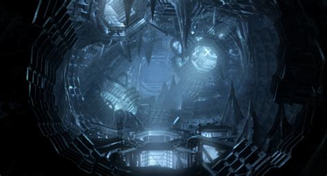

Programming assignment 3 (PA03)
==============================

# Recursive maze navigation 

---

## What is this repository?
The files listed here are the starting point for your assignment. 
Only add source files (not compiled files) to the Git repository.

## Note (actuall do this)!!
Thoroughly read the syllabus sections on "Programming assignments" and "Grading".
These sections give good tips, tricks, hints, and instructions for programming assignments, including how to submit via Git.

http://web.mst.edu/~taylorpat/Courses_files/DataStructures/Syllabus.html

## Assignment description
Help Niobe navigate through the matrix of service tunnels outside the matrix by creating a navigation system to find a path through this maze.
Your job is to write a program that finds, for every map, a path from wherever you are to the exit.
You can move in any of the four cardinal directions (North, East, West and South).
No diagonal moves are possible.
You must use recursive backtracking to solve the maze to get credit.
Cout each map with a path from the "Start" point to the "Exit".
Mark the path using a trail of the character '@'. 
Follow the format as in the sample output.
Mazes may or may not have a solution, and there may be loops or islands in the maze, though all that are inputted will be valid enclosed mazes, and Niobe will always exist once in each maze.
See the hints below! 'N' is Niobe, and 'E' is exit. 



## Input/Output
These are both specified in the sample_*.txt files provided in your repository. 

* Input is all via C++ std::cin. Even though sample_input.txt is a file, input is not via fstream or file input; we re-direct via **standard input**: https://en.wikipedia.org/wiki/Standard_streams. See the syllabus for details.
* The general form of input is here:
```
    <number of rows>
    <maze>
    <number of rows>
    <maze>
    0
```
Note: a row of 0 should terminate your program.

* sample_output.txt specifies exactly what your program should produce. We will use the Unix program **diff** to compare your output to this file, and if yours does not match, you will lose points.
* See the syllabus for details as to how to use $diff at the command line.

## Grading
95% of this assignment will be graded based on the successful implementation of the functions in the header file using unit testing, and the correct output of main.
Each function's performance on its own unit test will be worth a certain subset of those points, and the output of main will as well.
A correct submission will result in a grade of 95%.
The remaining 5% will be awarded based on run-time for you main, with the student with the fastest run-time in the class receiving a 100%, and the slowest correct submission receiving 95%, and a linear interpolation (not sequential) using your actual time in between.
You **must** use recursion; no you can't use a*.

## Hint: Reading Lines with White-Space:

In this assignment, you are required to read lines with white spaces.

You might attempt to use something like:
```
    cin >> maze[i][j];
```
But that would NOT work well, since the extraction operator>> ignores white spaces.

Instead, read input with getline and std::string instead; 
You may need to re-discover how to discard newlines to do this correctly;
I suggest reading the materials on strings here: http://web.mst.edu/~taylorpat/Courses_files/IntroProgramming/Content.html

## Due date
Please see the schedule on the website for all due dates.

